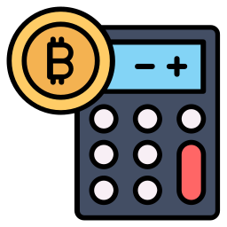

# SatsPrice

This app fetches the price of Bitcoin relative to common fiat currencies from multiple sources, and converts inputted amounts between Sats, BTC, and the selected fiat currency.

## Download and Install

## Supported Platforms

iOS 16.0+ • macOS 13.0+ • Android 7.0+

## Kotlin Multiplatform

This is a Kotlin Multiplatform project targeting Android, iOS, Web, Desktop (JVM).

* [/iosApp](./iosApp/iosApp) contains an iOS application. Even if you’re sharing your UI with Compose Multiplatform, you
  need this entry point for your iOS app. This is also where you should add SwiftUI code for your project.

* [/shared](./shared/src) is for code that will be shared across your Compose Multiplatform applications. It contains
  several subfolders:
    - [commonMain](./shared/src/commonMain/kotlin) is for code that’s common for all targets.
    - Other folders are for Kotlin code that will be compiled for only the platform indicated in the folder name. For
      example, if you want to use Apple’s CoreCrypto for the iOS part of your Kotlin app,
      the [iosMain](./shared/src/iosMain/kotlin) folder would be the right place for such calls. Similarly, if you want
      to edit the Desktop (JVM) specific part, the [jvmMain](./shared/src/jvmMain/kotlin)
      folder is the appropriate location.

### Running the apps

Use the run configurations provided by the run widget in your IDE's toolbar. You can also use these commands and
options:

- Android app: `./gradlew :androidApp:assembleDebug`
- Desktop app:
    - Hot reload: `./gradlew :desktopApp:hotRun --auto`
    - Standard run: `./gradlew :desktopApp:run`
- Web app:
    - Wasm target (faster, modern browsers): `./gradlew :webApp:wasmJsBrowserDevelopmentRun`
    - JS target (slower, supports older browsers): `./gradlew :webApp:jsBrowserDevelopmentRun`
- iOS app: open the [/iosApp](./iosApp) directory in Xcode and run it from there.

### Running tests

Use the run button in your IDE's editor gutter, or run tests using Gradle tasks:

- Android tests: `./gradlew :shared:testAndroidHostTest`
- Desktop tests: `./gradlew :shared:jvmTest`
- Web tests:
    - Wasm target: `./gradlew :shared:wasmJsTest`
    - JS target: `./gradlew :shared:jsTest`
- iOS tests: `./gradlew :shared:iosSimulatorArm64Test`

## Attribution

This project uses [Kotlin Multiplatform](https://www.jetbrains.com/help/kotlin-multiplatform-dev/get-started.html),
[Compose Multiplatform](https://github.com/JetBrains/compose-multiplatform/#compose-multiplatform), and
[Kotlin/Wasm](https://kotl.in/wasm/).

The [Bitcoin Calculator](https://www.flaticon.com/free-icons/bitcoin-calculator) icon was created by Icon home and licensed as free for personal and commercial use with attribution.

The following free APIs are used:
- Coinbase
  - [Get Exchange Rates](https://docs.cdp.coinbase.com/coinbase-app/docs/api-exchange-rates#get-exchange-rates)
  - [Get Spot Price](https://docs.cdp.coinbase.com/coinbase-app/docs/api-prices#get-spot-price)
- CoinGecko
  - [Coin Price by IDs](https://docs.coingecko.com/reference/simple-price)